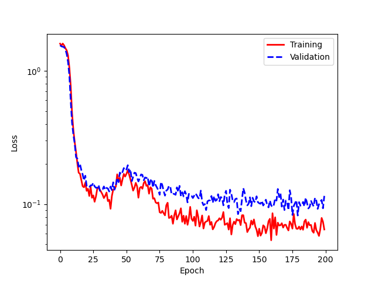
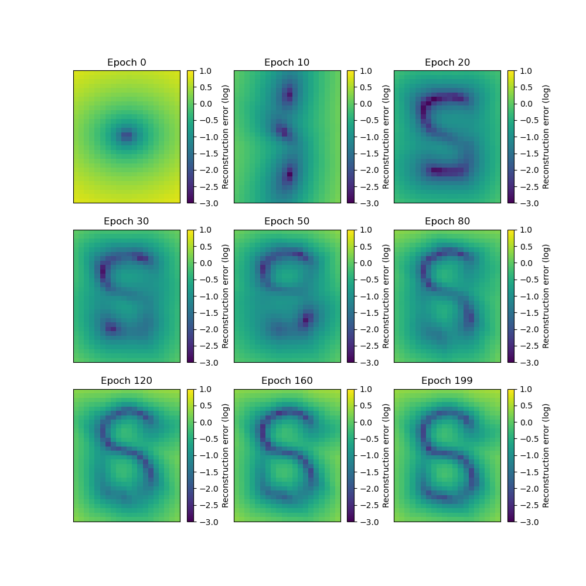
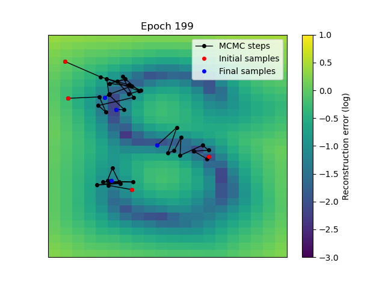

Tutorial
========

This tutorial features a WNAE training on the S curve scikit-learn dataset, illustrating the different functionalities of the WNAE class. An NAE training is also shown at the end of this tutorial.

Data generation
---------------

.. code-block:: python

    import matplotlib.pyplot as plt
    from sklearn.datasets import make_s_curve
    from sklearn.model_selection import train_test_split
    import numpy as np
    import torch
    import random

    # Fix seeds for reproducibility
    np.random.seed(0)
    random.seed(0)
    torch.manual_seed(0)

    # Number of bins and limits for plotting
    n_bins_x = 20
    n_bins_y = 30
    x_min = -2
    x_max = 2
    y_min = -3
    y_max = 3
    x_array = np.linspace(x_min, x_max, n_bins_x+1)
    y_array = np.linspace(y_min, y_max, n_bins_y+1)

    samples, labels = make_s_curve(n_samples=1000, noise=0.1)
    training_data, validation_data = train_test_split(
        samples[:, [0, 2]],
        test_size=0.2,
        shuffle=True,
    )

    # Plot the training data
    plt.figure()
    plt.scatter(training_data[:, 0], training_data[:, 1])
    plt.xlim((x_min, x_max))
    plt.ylim((y_min, y_max))

Data loader preparation
-----------------------

.. code-block:: python

    device = torch.device('cpu')
    
    def get_loader(data):
        data = torch.tensor(data.astype(np.float32)).to(device)
        sampler = torch.utils.data.RandomSampler(
            data_source=data,
            num_samples=2**13,
            replacement=True,
        )
        loader = torch.utils.data.DataLoader(
            dataset=torch.utils.data.TensorDataset(data),
            batch_size=512,
            sampler=sampler,
        )

        return loader

    training_loader = get_loader(training_data)
    validation_loader = get_loader(validation_data)

WNAE definition
---------------

.. code-block:: python

    import torch.nn as nn
    from wnae import WNAE

    class Encoder(nn.Module):
        def __init__(self, input_size):
            super().__init__()
            self.layer1 = nn.Linear(input_size, 32)
            self.layer2 = nn.Linear(32, 32)

        def forward(self, x):
            x = self.layer1(x)
            x = nn.functional.relu(x)
            x = self.layer2(x)
            x = nn.functional.relu(x)
            return x

    class Decoder(nn.Module):
        def __init__(self, output_size):
            super().__init__()
            self.layer1 = nn.Linear(32, 32)
            self.layer2 = nn.Linear(32, output_size)

        def forward(self, x):
            x = self.layer1(x)
            x = nn.functional.relu(x)
            x = self.layer2(x)
            return x

    wnae_parameters = {
        "sampling": "pcd",
        "n_steps": 10,
        "step_size": None,
        "noise": 0.2,
        "temperature": 0.05,
        "bounds": (-3, 3),
        "mh": False,
        "initial_distribution": "gaussian",
        "replay": True,
        "replay_ratio": 0.95,
        "buffer_size": 10000,
    }

    model = WNAE(
        encoder=Encoder(input_size=2),
        decoder=Decoder(output_size=2),
        **wnae_parameters,
    )

    model.to(device)

Training the model
------------------

.. code-block:: python

    from tqdm import tqdm

    def make_reco_error_map(model):
        model.eval()
        soboleng = torch.quasirandom.SobolEngine(dimension=2)
        sobol_draw = soboleng.draw(40)
        reco_errors = []
        for x_edge in x_array[:-1]:
            for y_edge in y_array[:-1]:
                x = sobol_draw[:, 0] * (x_max - x_min) / n_bins_x + x_edge
                y = sobol_draw[:, 1] * (y_max - y_min) / n_bins_y + y_edge
                data = torch.stack((x, y), dim=1)
                # Can use the evaluate method to only perform the evaluation
                reco_error = torch.mean(model.evaluate(data)["reco_errors"]).item()
                reco_errors.append([x_edge, y_edge, reco_error])

        reco_errors = np.array(reco_errors)
        return reco_errors

    def run_training(model, loss_function, n_epochs, plot_epochs):

        optimizer = torch.optim.AdamW(
            params=model.parameters(),
            lr=3e-4,
        )

        training_losses = []
        validation_losses = []
        mcmc_samples_list = []
        reco_error_maps = []

        for i_epoch in range(n_epochs):

            # Train step
            model.train()
            n_batches = 0
            training_loss = 0
            bar_format = f"Epoch {i_epoch}/{n_epochs}: " \
                + "{l_bar}{bar:10}| {n_fmt}/{total_fmt} [{elapsed}<{remaining}]"
            for batch in tqdm(training_loader, bar_format=bar_format):
                n_batches += 1
                x = batch[0]

                optimizer.zero_grad()
                # Use the `train_step` method to compute the loss
                if loss_function == "wnae":
                    loss, training_dict = model.train_step(x)
                elif loss_function == "nae":
                    loss, training_dict = model.train_step_nae(x)
                elif loss_function == "ae":
                    loss, training_dict = model.train_step_ae(x, run_mcmc=True, mcmc_replay=True)
                loss.backward()
                optimizer.step()

                training_loss += training_dict["loss"]

            training_loss /= n_batches
            training_losses.append(training_loss)

            # Validation step
            model.eval()
            n_batches = 0
            validation_loss = 0
            for batch in validation_loader:
                n_batches += 1
                x = batch[0]

                # Use the `validation_step` method to get the loss without
                # changing the internal state of the model
                if loss_function == "wnae":
                    validation_dict = model.validation_step(x)
                elif loss_function == "nae":
                    validation_dict = model.validation_step_nae(x)
                elif loss_function == "ae":
                    validation_dict = model.validation_step_ae(x, run_mcmc=True)
                validation_loss += validation_dict["loss"]
                # Only store the MCMC samples for visualization purpose for a few batches
                if n_batches == 1 and i_epoch in plot_epochs:
                    mcmc_samples_list.append(validation_dict["mcmc_data"]["samples"][-1])
                    reco_error_maps.append(make_reco_error_map(model))

            validation_loss /= n_batches
            validation_losses.append(validation_loss)

        return training_losses, validation_losses, mcmc_samples_list, reco_error_maps

    plot_epochs = [0, 10, 20, 30, 50, 80, 120, 160, 199]
    n_epochs = 200

    training_losses, validation_losses, mcmc_samples_list, reco_error_maps = \
        run_training(model, "wnae", n_epochs, plot_epochs)

Plot the loss
-------------

.. code-block:: python

    epochs = list(range(n_epochs))
    plt.figure()
    plt.plot(
        epochs,
        training_losses,
        color='red',
        linestyle='solid',
        linewidth=2,
        label="Training",
    )
    plt.plot(
        epochs,
        validation_losses,
        color='blue',
        linestyle='dashed',
        linewidth=2,
        label="Validation",
    )
    plt.xlabel("Epoch")
    plt.ylabel("Loss")
    plt.yscale("log")
    plt.legend()

Plot the MCMC samples
---------------------

.. code-block:: python

    def plot_mcmc_samples(mcmc_samples_list):
    
        plt.figure(figsize=(10, 10))
        
        for i in range(len(mcmc_samples_list)):
            mcmc_samples = mcmc_samples_list[i]
            epoch = plot_epochs[i]
            plt.subplot(3, 3, i + 1)
            plt.scatter(samples[:, 0], samples[:, 2], label='Data samples', alpha=0.1)
            plt.scatter(mcmc_samples[:, 0], mcmc_samples[:, 1], label='MCMC samples', alpha=0.5)
            plt.xticks(())
            plt.yticks(())
            plt.xlim((x_min, x_max))
            plt.ylim((y_min, y_max))
            plt.title('Epoch {}'.format(epoch))
            if i == 0:
                plt.legend()

    plot_mcmc_samples(mcmc_samples_list)

Plot the reconstruction error landscape
---------------------------------------

.. code-block:: python

    def plot_reco_errors(reco_error_maps):
        
        plt.figure(figsize=(10, 10))

        for i in range(len(reco_error_maps)):
            reco_error_map = reco_error_maps[i]
            epoch = plot_epochs[i]
            plt.subplot(3, 3, i + 1)
            h = plt.hist2d(reco_error_map[:, 0], reco_error_map[:, 1],
                        bins=(x_array, y_array),
                        weights=np.log10(reco_error_map[:, 2]))
            cbar = plt.colorbar(h[3])
            cbar.set_label("Reconstruction error (log)")
            plt.xticks(())
            plt.yticks(())
            plt.xlim((x_min, x_max))
            plt.ylim((y_min, y_max))
            plt.clim((-3, 1))
            plt.title('Epoch {}'.format(epoch))

    plot_reco_errors(reco_error_maps)

Plot trajectories of MCMC samples
---------------------------------

.. code-block:: python

    plt.figure()

    # Generate random initial points for the MCMC
    n_points = 4
    x = torch.rand(n_points, 1) * (x_max - x_min) + x_min
    y = torch.rand(n_points, 1) * (y_max - y_min) + y_min
    initial_state = torch.hstack((x, y))

    # Plot the reco error landscape
    epoch = plot_epochs[-1]
    h = plt.hist2d(
        reco_error_maps[-1][:, 0],
        reco_error_maps[-1][:, 1],
        bins=(x_array, y_array),
        weights=np.log10(reco_error_maps[-1][:, 2]),
    )
    cbar = plt.colorbar(h[3])
    cbar.set_label("Reconstruction error (log)")
    plt.xticks(())
    plt.yticks(())
    plt.xlim((x_min, x_max))
    plt.ylim((y_min, y_max))
    plt.clim((-3, 1))

    # Run the MCMC
    mcmc_samples = model.run_mcmc(x=initial_state, all_steps=True)

    # Plot MCMC samples evolution
    for i in range(len(mcmc_samples)):
        if i == 0:
            label0 = {"label": "MCMC steps"}
        else:
            label0 = {}
        plt.plot(mcmc_samples[i, 0, :], mcmc_samples[i, 1, :], "ko-",
                 markersize=4, linewidth=1, **label0)

    # Highlight initial and final steps
    plt.plot(mcmc_samples[:, 0, 0], mcmc_samples[:, 1, 0], "ro",
             markersize=4, linewidth=1, label="Initial samples")
    plt.plot(mcmc_samples[:, 0, -1], mcmc_samples[:, 1, -1], "bo",
             markersize=4, linewidth=1, label="Final samples")

    plt.xticks(())
    plt.yticks(())
    plt.xlim((x_min, x_max))
    plt.ylim((y_min, y_max))
    plt.title('Epoch {}'.format(epoch))
    plt.legend()

Standard NAE training
---------------------

.. code-block:: python

    # Fix seeds for reproducibility
    np.random.seed(0)
    random.seed(0)
    torch.manual_seed(0)

    nae_model = WNAE(
        encoder=Encoder(input_size=2),
        decoder=Decoder(output_size=2),
        **wnae_parameters,
    )

    nae_model.to(device)
    plot_epochs = [0, 10, 20, 25, 30, 32, 35, 38, 39]
    n_epochs = 40

    # Run NAE training
    training_losses, validation_losses, mcmc_samples_list, reco_error_maps = \
        run_training(nae_model, "nae", n_epochs, plot_epochs)

NAE training
------------

This illustrates a few points:

* the loss can get negative
* it is not straightforward to define the best epoch for the evaluation: the lowest absolute value of the loss does not coincide with the epoch at which the network has best learn the PDF of the training data
* the loss eventually diverges
* the MCMC samples are affected by the large gradients: most of them are pushed to the sampling boundaries (in which case they are invisible in the plots below) and the rest does not coincide with the low reco error phase space

.. code-block:: python

    # Plot the loss
    epochs = list(range(n_epochs))
    plt.figure()
    plt.plot(
        epochs,
        [abs(x) for x in training_losses],
        color='red',
        linestyle='solid',
        linewidth=2,
        label="Training",
    )
    plt.plot(
        epochs,
        [abs(x) for x in validation_losses],
        color='blue',
        linestyle='dashed',
        linewidth=2,
        label="Validation",
    )
    plt.xlabel("Epoch")
    plt.ylabel("Loss")
    plt.yscale("log")
    plt.legend()

    # Plot MCMC samples
    plot_mcmc_samples(mcmc_samples_list)

    # Plot reco error landscape
    plot_reco_errors(reco_error_maps)

